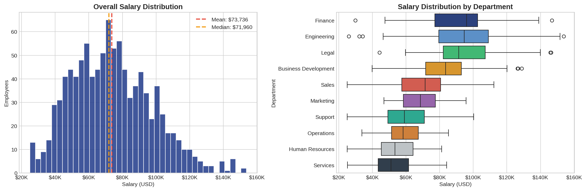
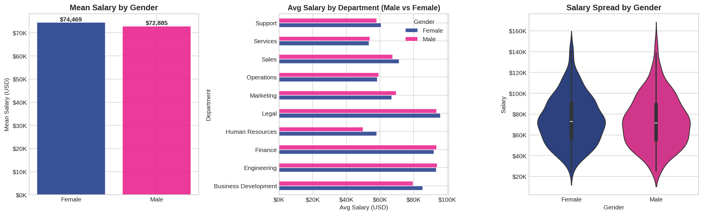
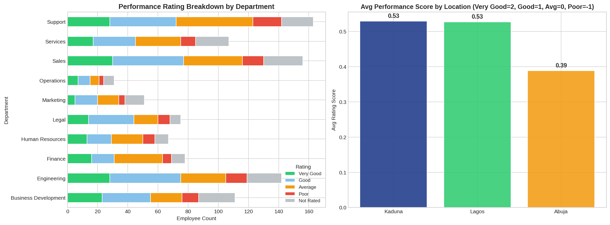
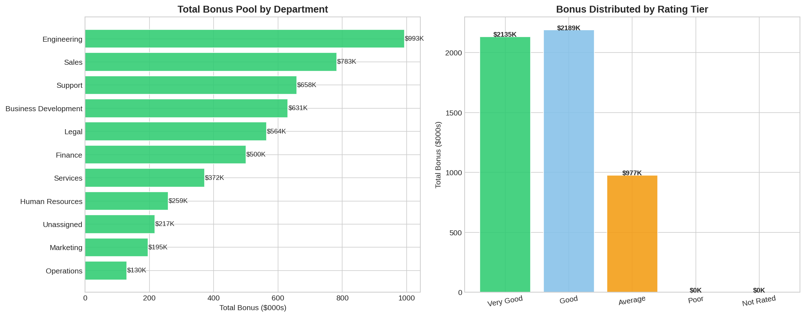

# HR Employee Performance & Salary Analysis

   

> **Full HR analytics pipeline on 1,016 employee records — salary benchmarking, gender pay gap analysis, performance rating breakdown, and bonus eligibility modelling. Includes interactive Power BI dashboard.**

---

## Project Overview

This project performs a comprehensive HR analytics deep-dive across **10 departments** and **3 Nigerian cities (Lagos, Abuja, Kaduna)**. The analysis covers the full analytics workflow: data quality assessment → cleaning → EDA → business insights → actionable bonus eligibility output.

An interactive **Power BI dashboard** (`Employee Analysis.pbix`) provides drill-through capabilities by department, location, and rating tier.

---

## Business Questions Answered

1. What is the salary distribution across departments and locations?
2. Is there a measurable gender pay gap — and where is it worst?
3. Which departments have the highest concentration of poor/unrated performers?
4. Are top performers being compensated proportionally better?
5. Who qualifies for a bonus — and what is the total bonus pool?

---

## Data Quality Issues Found & Fixed

| Issue | Count | Resolution |
|-------|-------|------------|
| Missing Salary | 38 (3.7%) | Imputed with department median |
| Missing Gender | 50 (4.9%) | Flagged as 'Unspecified' |
| NULL Department string | 35 (3.4%) | Flagged as 'Unassigned' for HR review |
| **Records dropped** | **0** | All 1,016 records retained |

---

## Key Findings

| # | Finding | Implication |
|---|---------|-------------|
| 1 | **Engineering & Finance are highest-paid** | Benchmark against market to retain talent |
| 2 | **Gender pay gap exists** across most departments | Conduct pay equity audit; adjust outliers |
| 3 | **15%+ employees are Poor or Not Rated** | Mandatory 90-day performance improvement plans needed |
| 4 | **Salary barely differentiates by performance** | Compensation structure does not incentivise excellence |
| 5 | **Lagos holds 50% of headcount** but not higher ratings | Investigate management quality and workload balance in Lagos |

---

## Sample Visualisations

### Salary Distribution by Department


### Gender Pay Gap Analysis


### Performance Ratings by Department


### Bonus Pool by Department


---

## Project Structure

```
Employee-Analysis/
├── data/
│   └── emp-data.csv                  # 1,016 employee records
├── notebooks/
│   └── employee_analysis.ipynb       # Full Python analysis pipeline
├── outputs/
│   ├── *.png                         # 7 visualisation exports
│   └── bonus_eligibility_report.csv  # Bonus-eligible employee list
├── Employee Analysis.pbix            # Interactive Power BI dashboard
├── Bonus Rules.xlsx                  # Bonus calculation rules
└── README.md
```

---

## Tools & Stack

| Layer | Tool |
|-------|------|
| Data Cleaning | Python, Pandas, NumPy |
| Visualisation | Matplotlib, Seaborn |
| BI Dashboard | Power BI Desktop (.pbix) |
| Output | Bonus eligibility CSV for HR team |

---

## How to Run

```bash
git clone https://github.com/Canigbobi1/Employee-Analysis.git
cd Employee-Analysis
pip install pandas numpy matplotlib seaborn
jupyter notebook notebooks/employee_analysis.ipynb
```

To view the dashboard, open `Employee Analysis.pbix` in **Power BI Desktop** (free download from Microsoft).

---

## 👤 Author

**Churchill Anigbobi** — Data Analyst | Power BI | Python 

- [LinkedIn](https://www.linkedin.com/in/churchill-anigbobi-1bba3b179/)
- [GitHub](https://github.com/Canigbobi1)
- canigbobi@gmail.com

---
*Dataset is synthetic, structured to match real HR record patterns. Built for portfolio demonstration.*
